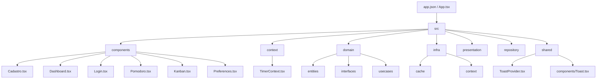

# mindease-mobile-v54

Aplicativo móvel MindEase — versão do repositório v54.

Este repositório contém a aplicação móvel desenvolvida com Expo + React Native, focada em gerenciamento de tempo (Pomodoro), Kanban simples e perfis de usuário. Abaixo há documentação detalhada sobre a estrutura do projeto, tecnologias, como inicializar o projeto e onde localizar os principais componentes.

**Status:** Código-fonte principal presente; configuração de Firebase em [src/firebaseConfig.tsx](src/firebaseConfig.tsx). Faça as configurações de credenciais antes de rodar em dispositivos reais.

**Tabela de conteúdo**

- **Descrição**
- **Tecnologias & versões**
- **Pré-requisitos**
- **Instalação & execução**
- **Estrutura de pastas**
- **Configurações importantes**
- **Diagrama (Mermaid)**
- **Contribuição**

**Descrição**

Aplicativo móvel para gerenciamento pessoal de tempo e tarefas com recursos básicos de Pomodoro, Kanban e perfis. Contém telas para cadastro/login, dashboard, preferências e um temporizador compartilhado via contexto.

Público-alvo: pessoas com Transtorno do Espectro Autista (TEA). O aplicativo foi projetado com esse público em mente, priorizando uma interface simples, previsível e opções para reduzir sobrecarga sensorial. Funcionalidades e fluxos foram pensados para minimizar distrações e oferecer controles claros e acessíveis.

**Considerações de acessibilidade para TEA**

- Interface simplificada e previsível — poucas distrações e navegação consistente.
- Controles e botões com alvos de toque maiores para facilitar interação.
- Opções para reduzir animações/efeitos e ajustar sinais sonoros ou vibração.
- Paleta de cores com contraste adequado e possibilidade futura de temas com menor estímulo visual.
- Temporizadores e feedbacks visuais/sonoros claros e configuráveis para ajudar no gerenciamento de rotinas.

**Tecnologias & versões**

- **React Native:** 0.81.5
- **React:** 19.1.0
- **React DOM / Web:** 19.1.0 / react-native-web ^0.21.0
- **Expo:** ~54.0.33
- **Navegação:** @react-navigation/native ^6.1.7, @react-navigation/native-stack ^6.9.12
- **Firebase (libs):** @react-native-firebase/app ^23.8.6
- **Async Storage:** @react-native-async-storage/async-storage 2.2.0
- **TypeScript:** ~5.9.2

As versões foram extraídas de `package.json`.

**Pré-requisitos**

- Node.js 20.19.4+ recomendado
- npm 10+ ou yarn
- Expo CLI (é possível usar via npx como nos scripts)
- Conta / credenciais Firebase (se usar features que dependem do Firebase)

**Instalação & execução**

1. Instalar dependências:

```bash
npm install
```

2. Rodar o projeto com Expo (abrir dev tools):

```bash
npm run start
```

3. Comandos úteis (definidos em `package.json`):

- `npm run android` — inicia o Expo e tenta abrir no emulador Android.
- `npm run ios` — inicia o Expo e tenta abrir no simulador iOS (macOS necessário).
- `npm run web` — roda versão web via `react-native-web`.

**Estrutura de pastas**

Apresentamos a árvore principal e explicação dos diretórios mais relevantes.



- **Raiz**
  - `App.tsx` — Entrada da aplicação.
  - `app.json` — Configurações do Expo.

- **src/**
  - `firebaseConfig.tsx` — Configuração e inicialização do Firebase (preencha com suas credenciais).

- **src/components/**
  - `Cadastro.tsx` — Tela de cadastro.
  - `Login.tsx` — Tela de login.
  - `Dashboard.tsx` — Tela principal com visão geral.
  - `Pomodoro.tsx` — UI do temporizador Pomodoro.
  - `Kanban.tsx` — Quadro de tarefas simples.
  - `Preferences.tsx` — Tela de preferências do usuário.

- **src/context/**
  - `TimerContext.tsx` — Contexto compartilhado do temporizador entre componentes.

- **src/domain/**
  - `entities/` — Entidades do domínio (`profile.entity.ts`, `user.entity.ts`).
  - `interfaces/` — Interfaces de domínio.
  - `usecases/` — Casos de uso (lógica de aplicação).

- **src/infra/**
  - `cache/` — Serviço de cache local.
  - `context/` — Contextos de infra (Auth, Theme).

- **src/presentation/**
  - `ProfileController.ts`, `UserController.ts` — Camada de apresentação/controle.

- **src/repository/**
  - Repositórios de dados (`user.repository.ts`, `profile.repository.ts`).

- **src/shared/**
  - `ToastProvider.tsx`, `toastService.ts` — Sistema de notificações/toasts.
  - `components/Toast.tsx`, `ToastContext.tsx` — UI e contexto de toasts.

**Configurações importantes**

- Antes de rodar em produção, configure o `src/firebaseConfig.tsx` com as chaves do seu projeto Firebase. O arquivo é o ponto central para integração com serviços Firebase.
- Verifique permissões e regras do Firebase (Auth / Firestore) ao conectar com dados reais.

**Como estender**

- Para adicionar novas telas, crie o componente em `src/components/` e registre rotas no fluxo de navegação (provavelmente em `App.tsx` ou onde o navigator é definido).
- Para novos casos de uso, adicione lógica em `src/domain/usecases` e atualize/usar repositórios em `src/repository`.

**Contribuição**

- Abra uma issue antes de grandes mudanças.
- Envie PRs com descrição clara das alterações.
